# 🏥 PainKiller: Chronic Illness Prevention App

## 📌 Overview
PainKiller is a mobile application designed to help individuals take control of their health and prevent chronic illnesses such as **diabetes, heart disease, and obesity**. It provides **activity tracking, health monitoring, diet management, and expert consultation** features.

## 🔧 Tech Stack
- **Backend:** Firebase (Authentication, Database)
- **Frontend:** Android (ViewModel, XML-based UI)
- **Libraries:** Stream Chat API for messaging
- **Data Storage:** Shared Preferences for user sessions

## 🎯 Features

### 🔹 Authentication & User Management
- **Login/Logout:** Secure authentication using Firebase.
- **Sign-up:** New users can register with email and password.
- **Profile Management:** Users can update their health data such as **DOB, gender, blood type**.
- **Password Management:** Change and reset passwords securely.

### 🔹 Health & Activity Tracking
- **Daily Check-ins:** Monitor physical & mental well-being.
- **Activity Tracking:** Step counting, workout monitoring, goal tracking.
- **Health Measurement:** Track vitals like **blood pressure, glucose level, pulse rate**.
- **Health Score:** Calculate user health levels based on global standards.

### 🔹 Nutrition & Lifestyle
- **Healthy Diet Section:** View nutrition info & track meals.
- **Health Information Hub:** Browse articles, videos, and expert advice.
- **Journaling:** Log daily activities, workouts, meals, and emotions.

### 🔹 Communication & Support
- **Chat Feature:** Real-time messaging with **doctors, nutritionists, and fitness coaches**.
- **Voice & Video Calls:** Engage with health professionals.
- **Notifications & Alerts:** Get reminders for medication, workouts, and health risks.

## 🏗 Architecture & Design
- **MVVM (Model-View-ViewModel)** pattern for UI separation.
- **Navigation:** Bottom navigation for **Check-in, Workout, Chat, and Profile**.
- **Data Handling:** Uses **Firebase collections** for real-time updates.

## 🚀 Getting Started

### Prerequisites
- **Android Studio** (latest version)
- **Firebase Project Setup**
- **Google Services JSON** configured

### Installation
1. Clone the repository:
   ```bash
   git clone https://github.com/yourusername/PainKiller.git
   ```

## 🎨 User Interface (UI) & Navigation Screenshots

### 🔹 Navigation Flow
#### Option Menu Navigation
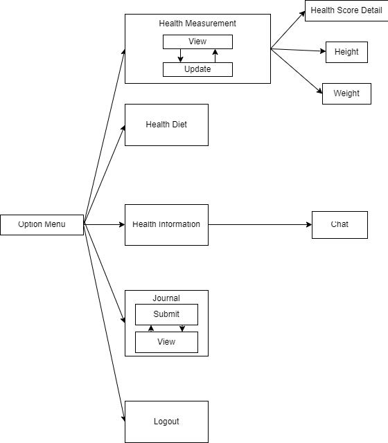

#### Workout Navigation
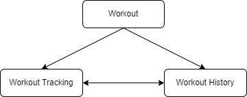

#### Simplified Navigation Flow
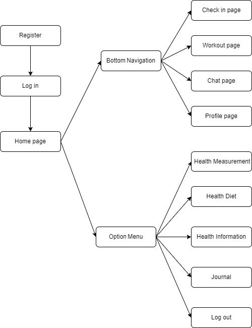

#### Check-in Navigation
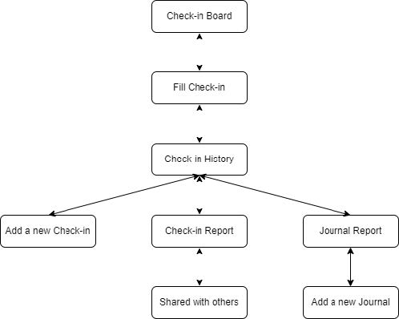

#### User Management Navigation
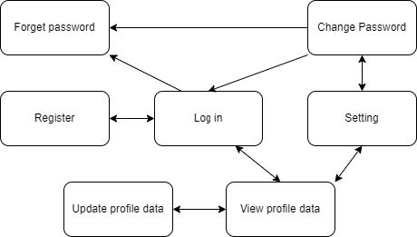

---

### 🔹 User Interface Screens

#### Journal
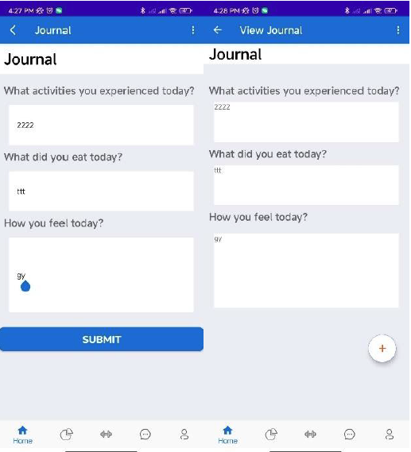

#### Health Information
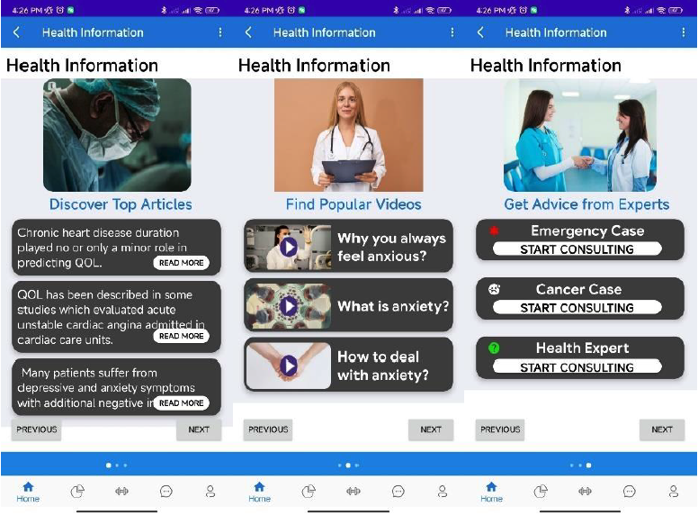

#### Diet Tracking
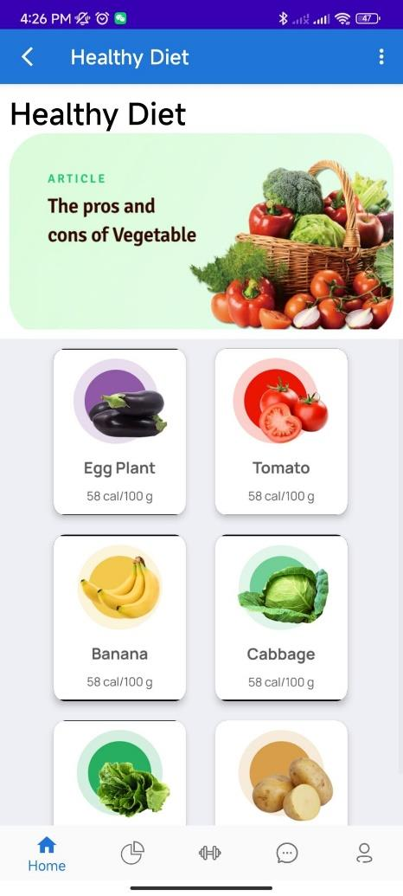

#### Health Measurement
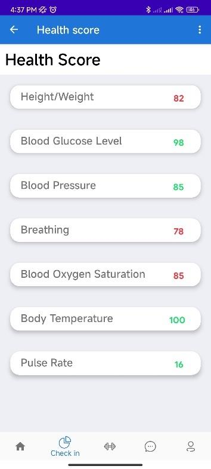

#### Health Score
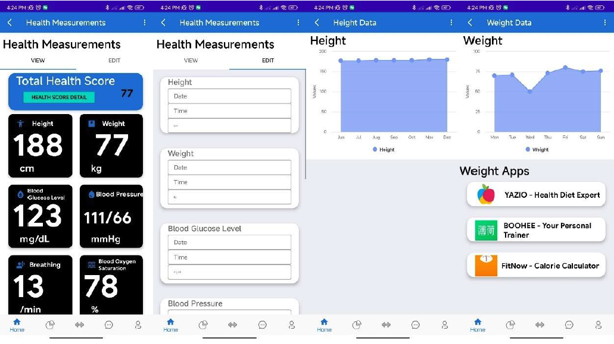

---

### 🔹 Use Case Diagrams

#### Option Menu Use Case
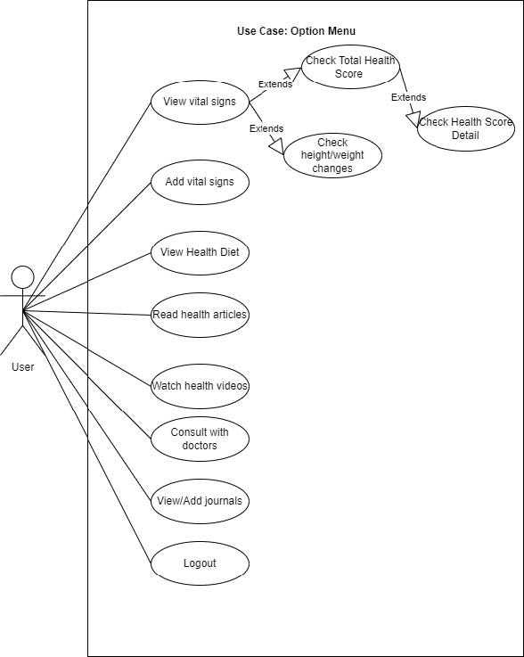

#### User Management Use Case
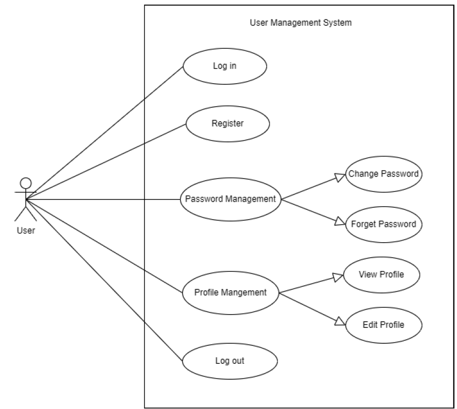

#### Bottom Navigation Use Case
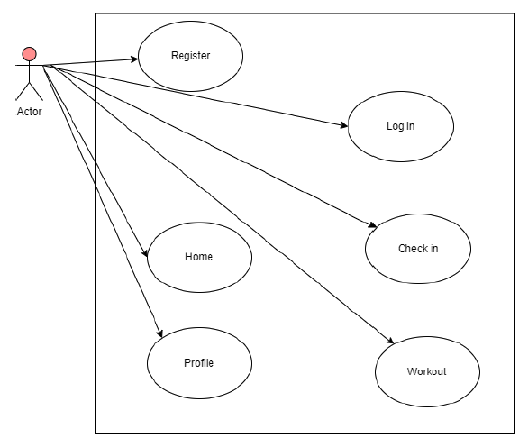

---

### 🔹 User Features Screens

#### Chat
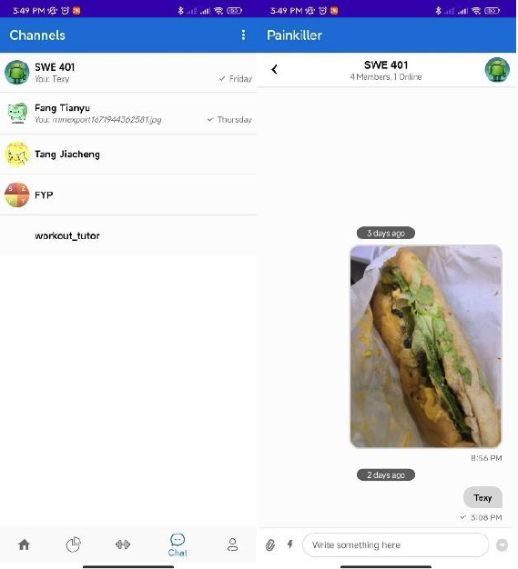

#### Activity Tracking
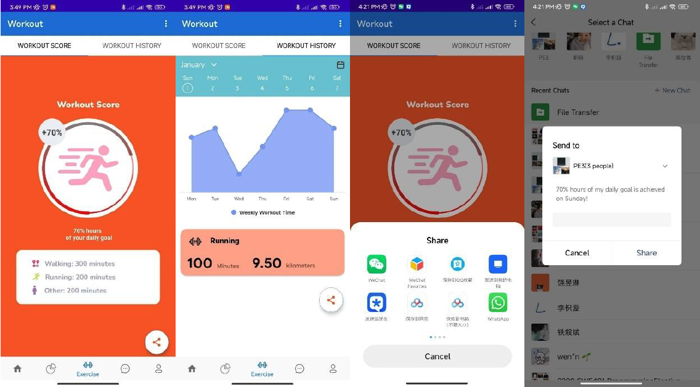

#### Check-in
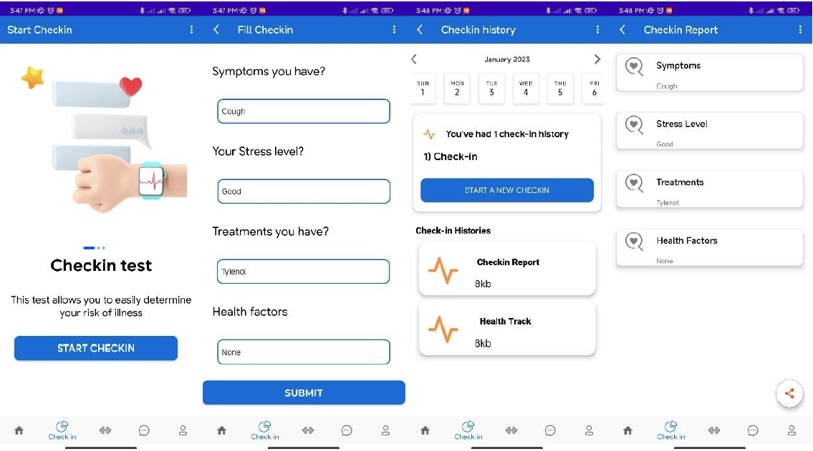

#### Homepage
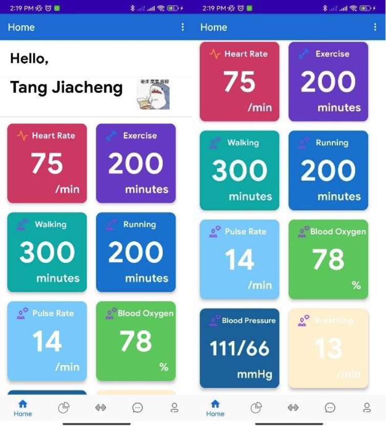

#### Password Reset
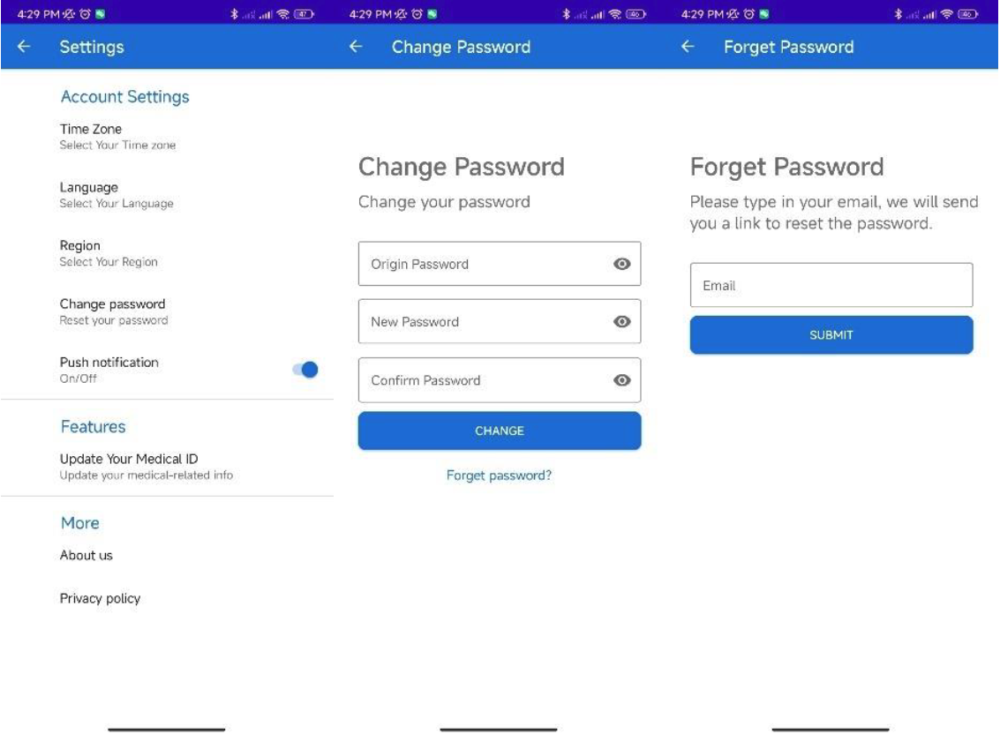

#### User Profile
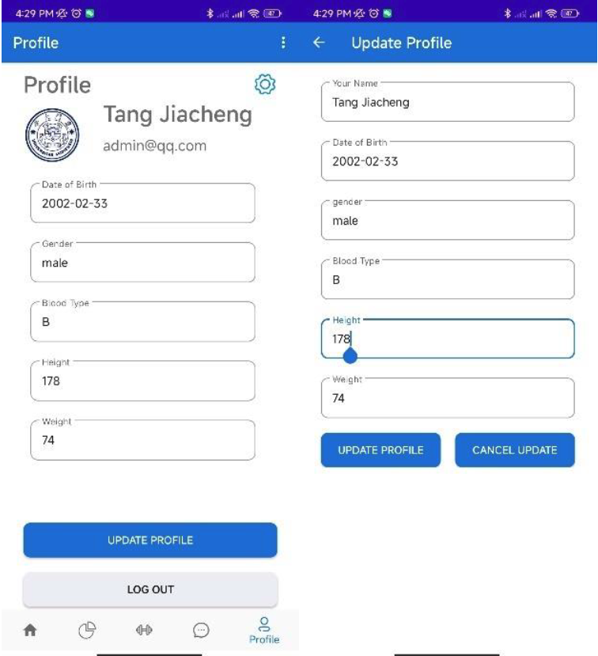

#### Sign-in
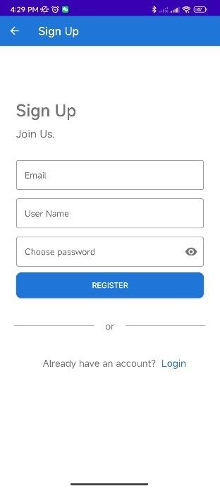

#### Login
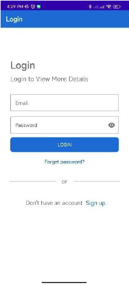

---

### 📌 Architecture Design
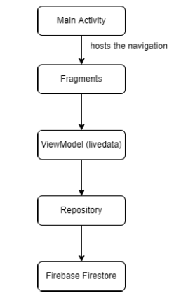
